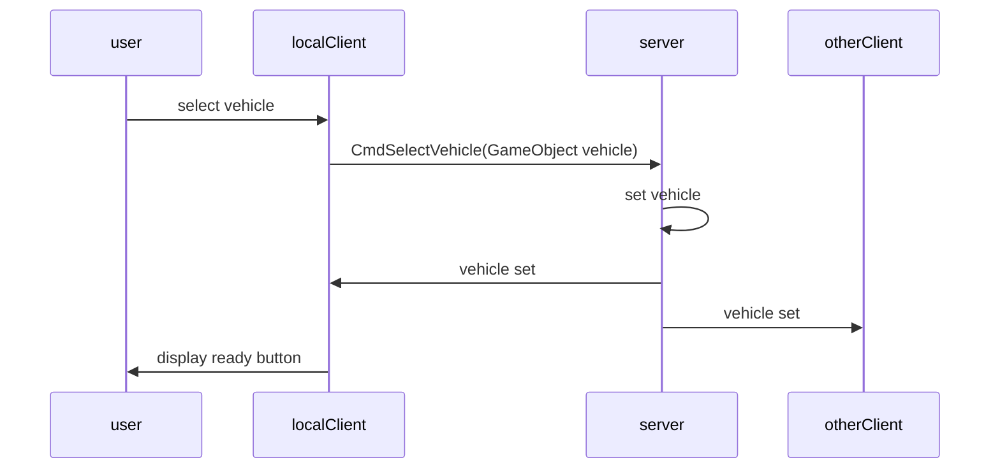

# Network Mode
lorem ipsum



```c#
    [Command]
    private void CmdSelectVehicle(GameObject vehicle){
        Debug.Log("Command Select: " + vehicle.name);
        
        PlayerVehiclePrefab = vehicle;

    }
```